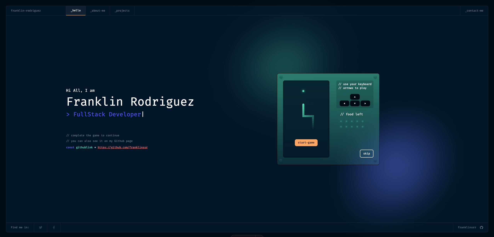

<h1 align="center">
  franklin-rodriguez portfolio
</h1>

This is my personal portfolio website built using [Astro.js](https://astro.build/). The project showcases my skills, experience, and the projects I've worked on. In addition to Astro, I have used React and Vue.js to create interactive components for different sections of the website.



## 🚀 Technologies Used

- **Astro.js**: The core framework for building this static site.
- **React**: Used for creating dynamic components.
- **Vue.js**: Used for creating the snake game.
- **CSS/SCSS**: Styling for the project to ensure a polished and responsive UI.
- **JavaScript/TypeScript**: Core language for building the logic behind the components.

## 🛠️ Project Setup

### Prerequisites

Make sure you have the following installed:

- [Node.js](https://nodejs.org/en/) (v14+)
- [npm](https://www.npmjs.com/) or [yarn](https://yarnpkg.com/)

### Installation

1. Clone the repository:

   ```bash
   git clone https://github.com/yourusername/your-portfolio.git
   cd your-portfolio
   npm install
   # or
   pnpm install
   ```
2. Running the Development Server
    - To start the development server and view your portfolio in the browser:
    ```bash
    npm run dev
    # or
    pnpm dev
    ```
    The site will be available at http://localhost:4321

3. 🚀 Building for Production
    - To generate the static files for production:
    ```bash
    npm run build
    # or
    pnpm build
    ```
    - This will create a dist folder with the built files that can be deployed to any static hosting service.

## Project Structure

    ├── public/               # Static assets like images, fonts, etc.
    |__ .vscode               # all the CM scopes and vscode settings
    |__ .github               # all github workflows, CI/CD
    ├── src/                  
    │   ├── components/       # React and Vue.js components
    │   ├── layouts/          # Layout components for Astro
    │   ├── pages/            # Pages for the site
    │   ├── styles/           # Global and component-specific styles
    │   └── utils/            # Utility functions and hooks
    |   └── store/            # all zustand store
    |   └── interfaces/       # all types and interfaces
    |   └── hooks/            # custom hooks
    |   └── constants/        # all contants variables
    |   └── assets/           # some static files
    ├── astro.config.mjs      # Astro configuration
    |__ eslint.config.js      # eslint configuration file
    |__ tailwind.config.mjs   # tailwindcss configuration theme/plugin file
    |__ prettierrc.mjs        # prettier configuration file
    └── package.json          # Project dependencies and scripts


## 💡 Key Features
 - Modern UI: Clean and responsive design using modern CSS techniques.
 - Interactive Components: React and Vue.js components that add interactivity.
 - Optimized for SEO: Astro's built-in SEO features for better search engine    visibility.
 - Fast Performance: Leveraging Astro's static site generation for optimal loading times.

 ## Deployment
Once you’ve built the project, you can deploy it to any static site hosting service. Some popular options include:

- Vercel

you also can use netlify but you will need to install the adapter

## 📄 License
This project is licensed under the MIT License. See the LICENSE file for more details.

## inspire by
The first open source version of Portfolio for [Developers Concept V.2](https://www.figma.com/community/file/1100794861710979147/portfolio-for-developers-concept-v-2), designed by [@darelova](https://www.behance.net/darelova) and developed by 
